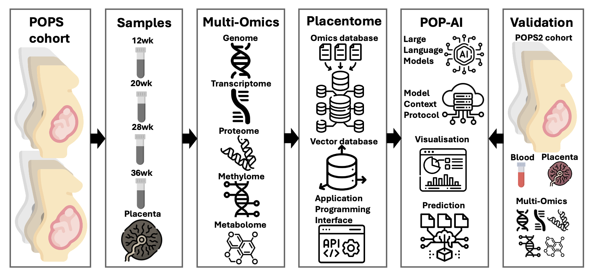

Hello, my name is [Sung](https://sung.github.io). I am a researcher at Cambridge university interested in AI/ML and applying to predicting pregnancy complications. I am planning a study and need the help of women and birthing people to shape the project. 

## 🔍 What Is This Research About?

This proposed study will look at how we can use advanced computer intelligence to understand the complex biological signals in a mother's body very early in pregnancy. I want to find better ways to predict health issues like [pre-eclampsia](https://www.nhs.uk/conditions/pre-eclampsia/) and [fetal growth restriction](https://www.tommys.org/pregnancy-information/pregnancy-complications/fetal-growth-restriction-intrauterine-growth-restriction) before they become an emergency, giving families peace of mind.

## 🔧 What Am I Going to To?

I will be developing a smart "team" of AI programs called **POP-AI** that acts as a digital specialist for pregnancy health. It combines different types of biological data—like blood tests and genetics—to give doctors a clear, reasoned explanation of a pregnancy's health status.

{#fig-study-design}

## 📅 Workflow

::: {#fig-workflow}
<svg width="100%" height="100" viewBox="0 0 800 80" xmlns="http://www.w3.org/2000/svg">
  <rect x="10" y="20" width="200" height="40" rx="6" fill="#E6F6FF" stroke="#2B6CB0"/> <text x="110" y="45" font-size="15" text-anchor="middle" fill="#2B6CB0">Discovery (POPS cohort)</text>
  <polygon points="210,40 220,30 220,50" fill="#2B6CB0" />
  <rect x="220" y="20" width="140" height="40" rx="6" fill="#FFF7ED" stroke="#DD6B20"/> <text x="290" y="45" font-size="15" text-anchor="middle" fill="#DD6B20">Data Integration</text>
  <polygon points="360,40 370,30 370,50" fill="#DD6B20" />
  <rect x="370" y="20" width="160" height="40" rx="6" fill="#FFF5F7" stroke="#C53069"/> <text x="450" y="45" font-size="15" text-anchor="middle" fill="#C53069">POP-AI</text>
  <polygon points="530,40 540,30 540,50" fill="#C53069" />
  <rect x="540" y="20" width="200" height="40" rx="6" fill="#F7FFF0" stroke="#48BB78"/> <text x="630" y="45" font-size="15" text-anchor="middle" fill="#48BB78"> Validation (POPS2)</text>
</svg>

High-level workflow from discovery to deployment
:::

## 🌟 Goal

To establish a "Precision Obstetrics" framework by developing a multi-modal data warehouse and agentic AI systems that translate genomic, transcriptomic, methylomic, proteomic and metabolomic data to identify early complicated pregnancies.

## 🧪 Why Is It Necessary?

Currently, many pregnancy complications are only found when they are already serious and difficult to treat. By spotting these risks much earlier, we can provide mothers with the right care at the right time, keeping both them and their babies safe from harm.

## 👩‍🍼 Why This Matters

Early identification means closer monitoring, personalised care, and better outcomes for mothers and babies.

## 🤝 How Are Patients and the Public Involved?

Women with lived experience of pregnancy complications help us:

- shape the research questions,
- review information materials,
- design how results are shared,
- ensure the test is acceptable and useful,

Their voices guide the direction of the project.

## 🎥 Watch Our Webinar

Below is a short webinar-style presentation explaining the project and how you can get involved.

<iframe width="100%" height="400" src="https://www.youtube.com/embed/9nts6IFt578" title="PPIE Webinar" frameborder="0" allowfullscreen></iframe>

## 🗳️ Take Part in Our PPIE Survey

I would like to invite members of public, especially parents and expectant mothers, to take part in our **short online survey**.
Your opinions will help guide the direction of our work.

👉 **[Click here to take the survey](https://forms.office.com/e/AYFbkgAYEU)**
*(or scan the QR code below)*

{#fig-qr-code width=400px fig-align="left"}

All responses are anonymous and confidential.

Your voices and experiences are essential:

- Reflects **real needs and priorities** of expectant families.
- Uses **language and outcomes** that are understandable and meaningful.
- Respects the **values and concerns** of those directly affected by pregnancy complications.
- Leads to **better communication** between researchers, clinicians, and families.

## Contact

If you have questions or would like to get involved further, please contact me at:
Sung Gong: 📧 **ssg29@cam.ac.uk**

Thank you for your interest and support!
